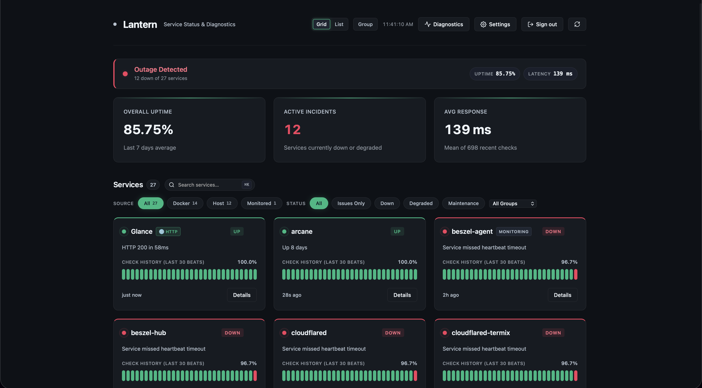
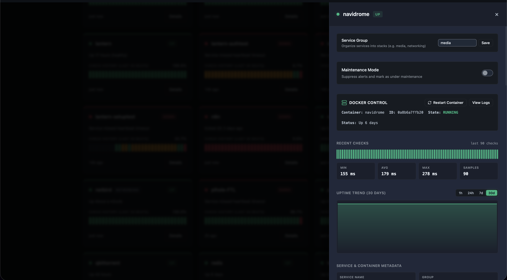
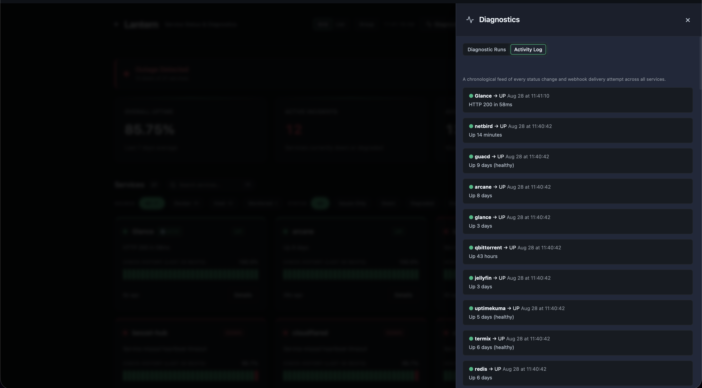
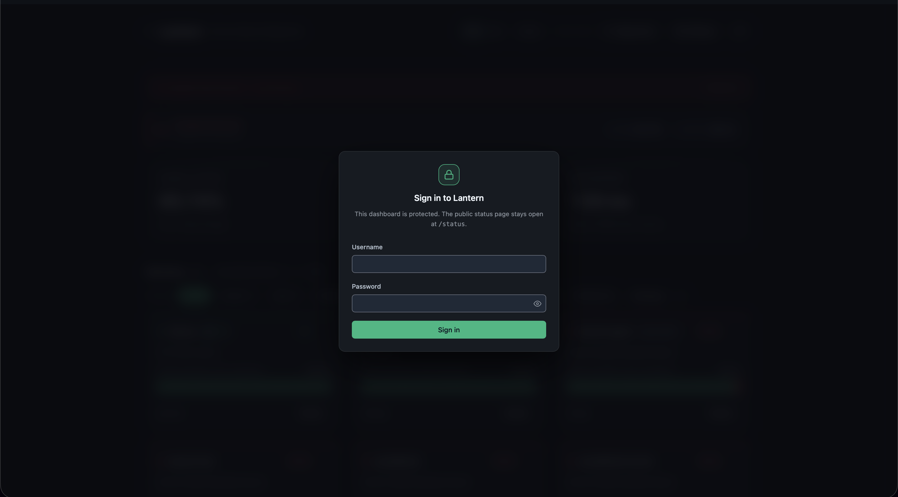

# Lantern

> ### Stable as of v0.60.0
>
> The REST API and database schema are now considered stable, and breaking changes will
> come with a major version bump and upgrade notes. Pinning a version tag rather than
> `latest` is still the recommendation for anything you depend on, and
> [backups](docs/BACKUP.md) are still a good idea.
>
> **On exposure:** Lantern is built for a home or private network. It ships with a
> sign-in gate, per-request timeouts, and a deliberately small anonymous surface, but it
> is not a hardened public-internet service — there is no rate limiting beyond the login
> throttle, and no WAF. If you put it on the open internet, put a reverse proxy with TLS
> in front of it and turn sign-in on. Bug reports and issues are very welcome.

Lantern is a lightweight status dashboard and monitoring server built in Go. It provides a single-page application (SPA) UI with dark/light themes, native Docker container discovery, a push-based "heartbeat" API, and optional active checks for tracking service uptimes, downtimes, and maintenance windows in real time.

It uses a `modernc.org/sqlite` backend (no CGO required, cross-compiles easily) and compiles down to a single tiny binary or a lightweight Docker container.



## Features (v0.62.1)

- **Native Docker Discovery**: Mount the Docker socket and Lantern discovers and polls every container on the host by itself — no push script, no agent, no per-service configuration. New containers appear on the dashboard automatically; opt one out with the label `lantern.ignore=true`.
- **Live Heartbeat Bar**: Each card shows the last 30 individual checks as a sliding bar, with a new beat animating in over the WebSocket as it arrives. Hovering a beat reports how long ago it landed, its absolute time, the check's latency, and the reported message.
- **Per-check Latency**: Every status event records how long its check took, from all three sources — the Docker poller, active monitors, and passive pushes that supply an optional `latency_ms`.
- **Real-time Dashboard**: A WebSocket connection pushes status changes to every open dashboard within about a second of them happening, with automatic reconnection and a manual-refresh fallback. Cards glow briefly in their status color when a live update lands.
- **Push-based Heartbeats**: Services can also report their own status via `POST /api/status`, so Lantern can track things it cannot reach — hosts behind NAT, systemd units, or anything with a shell and `curl`.
- **Optional Active Monitoring**: Have Lantern check a service itself — HTTP(S), TCP port, or real ICMP ping — on a configurable interval, run concurrently through a bounded worker pool. Results feed the same history, uptime %, and incident pipeline.
- **Public SVG Status Badges**: `GET /api/badge/{service}.svg` renders an embeddable shields-style badge for any service, served anonymously so it works in a README.
- **Flap-dampened Alerts**: An outage must be confirmed by two consecutive `down` checks before it notifies, and it notifies once per episode rather than once per check. A single bad check produces no traffic at all instead of a down alert followed immediately by a recovery.
- **SSL Certificate Expiry Tracking**: HTTP(S) active monitors capture the live certificate's expiry date and surface a warning when it's within 14 days of expiring.
- **Non-blocking Webhook Delivery**: Discord, Telegram, Gotify, and generic webhook dispatch runs through a bounded worker pool with per-request timeouts, so a slow or unreachable endpoint never delays status ingestion. Every delivery attempt (success or failure) is logged and visible in Settings.
- **Cross-service Activity Log**: A chronological feed of every status change and webhook delivery attempt across all services, in the Diagnostics drawer.
- **Data Export**: Download any service's full status history as CSV or JSON from its detail drawer.
- **Database Backup**: Download a consistent point-in-time snapshot of the entire database (via `VACUUM INTO`, safe under concurrent writes) from Settings — see [Backup & Restore](docs/BACKUP.md).
- **Service Grouping**: Organize services into custom groups (e.g. `media`, `networking`, `monitoring`) with dedicated filtering on the dashboard.
- **Docker Management**: Integrated Docker controls for container restart and live log tails from the service detail drawer (guarded behind admin auth).
- **Service Detail & Metadata Inspector**: Real-time inspection of container ports, image tags, IP addresses, network topology, and health check history.
- **Background Stale Detection**: Automatically marks services as "Down" (Stale) if they miss their heartbeat window (configurable via `LANTERN_STALE_HOURS`).
- **Web-based Webhook Configuration**: Dedicated Settings drawer to configure, save, and test Discord, Telegram, Gotify, and generic webhooks with real-time test output and a delivery history log.
- **Theming & Dynamic Accent Picker**: Dark, Midnight, and Light themes with customizable accent colors that reactively update across the entire dashboard, including a design-token system (spacing, type, shadow, motion scales) built around the accent color.
- **Instant Search & Real-time Filters**: Instant substring search across service names, groups, and messages with empty-state and toast notifications.
- **Responsive Layout**: Usable down to mobile viewport widths, not just non-overflowing.
- **Maintenance Mode**: One-click UI toggles to silence alerts and ignore downtime during planned maintenance.
- **Sign-in with Cookie Sessions**: Set a username and password — from the environment on first boot, or from **Settings → Account & Security** on a dashboard that is currently open — and Lantern hashes them with bcrypt into SQLite and puts a login gate in front of everything except the public status surface. Sessions are `HttpOnly`, `SameSite=Strict` cookies, which is also what authenticates the live WebSocket feed, since a browser's `WebSocket` constructor cannot send an `Authorization` header. Failed logins are throttled per client address.
- **Admin & Scoped API Tokens**: An admin-wide `LANTERN_AUTH_TOKEN` (settable from the dashboard's own Settings drawer) gates writes, Docker controls, database backups and webhook configuration, plus per-service scoped tokens for automation — all while keeping public status routes unauthenticated.
- **Command Palette & Collapsible Groups**: `Cmd`/`Ctrl`+`K` (or `/`) opens a fuzzy-search palette over every service; group sections collapse and remember their state.
- **Source Filters**: Every service reports whether its status comes from active monitoring, Docker discovery, or a pushed heartbeat, with one-click filtering by source.
- **Service Lifecycle Controls**: Delete a service and everything Lantern has recorded about it in a single transaction, or trigger an active check on demand instead of waiting for the next tick.
- **Design-token System**: Surface and semantic color tokens, a motion scale, a layered modal shell with real focus management, and a 4.5:1 contrast floor on every status badge.
- **Prometheus Metrics**: A `/metrics` endpoint for scraping service status, uptime ratios, and incident counts into an existing monitoring stack.
- **Announcement Banner**: Publish a maintenance or incident notice from **Settings → Announcement** and it pins to the top of both the dashboard and the public `/status` page, in three severities. Reading it is always anonymous — that is the point of a status banner; publishing and taking it down require admin.
- **Per-service Alert Routing**: Send one service's alerts to Discord and another's to Telegram. A service with no route configured alerts everywhere, so existing installs behave exactly as before.
- **Configurable TLS Expiry Thresholds**: HTTPS monitors classify certificates as `ok`/`warning`/`critical`/`expired` against `LANTERN_CERT_WARN_DAYS` and `LANTERN_CERT_CRITICAL_DAYS`. A certificate days from expiry degrades the service; an expired one marks it down.
- **Config Export & Import**: `GET /api/config/export` serialises every service, probe, group, alert route and webhook to portable JSON; `POST /api/config/import` restores it. Secrets are redacted by default.
- **Installable (PWA)**: A web app manifest and an SVG favicon, so Lantern installs to a phone home screen or a desktop dock and opens standalone.

## Screenshots

<table>
  <tr>
    <td></td>
    <td></td>
  </tr>
  <tr>
    <td></td>
    <td></td>
  </tr>
</table>

## Quick Start (Docker)

The easiest way to get started is with Docker Compose.

```yaml
services:
  lantern:
    image: ghcr.io/manasvinyadav/lantern:v0.62.1
    container_name: lantern
    restart: unless-stopped
    ports:
      - "7654:7654"
    volumes:
      - lantern_data:/data
      # Mount the Docker socket to enable native container discovery.
      # Note: :ro applies to the mount point, not to the Docker API — the
      # daemon still accepts writes over this socket, so treat access to it
      # as equivalent to root on the host.
      - /var/run/docker.sock:/var/run/docker.sock:ro
    environment:
      # Secure your API
      - LANTERN_AUTH_TOKEN=your_secret_token
      # Configure Notifications
      - LANTERN_WEBHOOK_DISCORD=https://discord.com/api/webhooks/...

volumes:
  lantern_data:
```

```bash
docker compose up -d
```

Access the dashboard at `http://localhost:7654/`. Every container on the host appears
on its own, with no further configuration.

### Not using Docker?

Discovery simply stays inactive if the socket is not mounted, and Lantern works exactly
as before via `POST /api/status` and active monitors. To monitor things Docker cannot
see — systemd units, remote hosts, cron jobs — push a heartbeat:

```bash
curl -sf -X POST http://localhost:7654/api/status \
  -H "Content-Type: application/json" \
  -d '{"service_name":"nightly-backup","status":"up","message":"Completed","latency_ms":812}'
```

## Status Badges

Embed a live badge for any service:

```markdown

```

Colors follow the service's current status: green for up, red for down, amber for
degraded, grey for maintenance or unknown.

## Security

Lantern has three authentication modes, and picks based on what you configure:

| Configured | Behaviour |
|---|---|
| Nothing | Fully open. The out-of-the-box default, kept deliberately so that adding auth can never lock an existing deployment out of itself. |
| `LANTERN_AUTH_TOKEN` | Writes, Docker controls, `GET /api/backup` and `GET /api/webhooks` require the bearer token. Dashboard reads stay open and no login wall appears. |
| Username + password | A login gate in front of everything except the public status surface. |

These stay anonymous whatever you configure, because they have to:
`/status` and the static shell, `GET /api/public/services`, `/api/public/groups`,
`/api/public/services/{name}/uptime`, `/api/public/ws`, `/api/badge/*`, `/metrics`,
`/api/health`, `/api/docs`, and the two endpoints needed to sign in. The exact list is in
the [Configuration Guide](docs/CONFIG.md#always-open).

**v0.60.0 fixes several authentication flaws** found in a pre-release audit, including an
unauthenticated admin takeover reachable when only `LANTERN_AUTH_TOKEN` was set, and a
stored cross-site scripting flaw reachable by anyone able to push a status event. If you
run any earlier version, upgrading is worth doing promptly — see the
[changelog](CHANGELOG.md#v0600--sign-in-security-hardening--a-rebuilt-dashboard) for the
full list and for what to rotate afterwards.

Found something? Open an issue, or contact the maintainer privately for anything
exploitable.

## Documentation Suite

Lantern is highly configurable. Dive into the detailed guides below:

- 📖 **[API Reference](docs/API.md)**: Full list of endpoints, payloads, and examples.
- ⚙️ **[Configuration Guide](docs/CONFIG.md)**: Detailed breakdown of all environment variables, auth, and database settings.
- 🐳 **[Docker Discovery](docs/CONFIG.md#native-docker-discovery)**: How native container discovery works, its status mapping, and how to opt containers out.
- 🔔 **[Webhooks & Notifications](docs/WEBHOOKS.md)**: Setup guides for Discord, Telegram, Gotify, and generic integrations.
- 💾 **[Backup & Restore](docs/BACKUP.md)**: How to download a consistent database snapshot and restore it.
- 📝 **[Changelog](CHANGELOG.md)**: Release history and patch notes.

## Quick API Example

Pushing a heartbeat is as simple as a single POST request:

```bash
curl -X POST http://localhost:7654/api/status \
  -H "Authorization: Bearer your_secret_token" \
  -H "Content-Type: application/json" \
  -d '{
    "service_name": "database",
    "status": "up",
    "message": "Latency normal",
    "latency_ms": 42
  }'
```

## Building from Source

Lantern can be natively compiled into a standalone binary:

```bash
go mod download
go build -ldflags="-s -w" -o lantern .
./lantern
```

Run the test suite with:

```bash
go vet ./... && go test -race ./...
```

CI runs `gofmt`, `go vet` and `go test -race` on every push, and the container image is
only built if they pass.

> On a 64-bit Raspberry Pi, `-race` aborts with `unsupported VMA range`: Raspberry Pi OS
> builds its kernel with `CONFIG_ARM64_VA_BITS=39`, and ThreadSanitizer needs a wider
> address layout. This is specific to that kernel configuration — macOS and ordinary
> x86-64 Linux are both fine. Drop the flag when testing on the Pi and let CI cover it.

## License
MIT License
