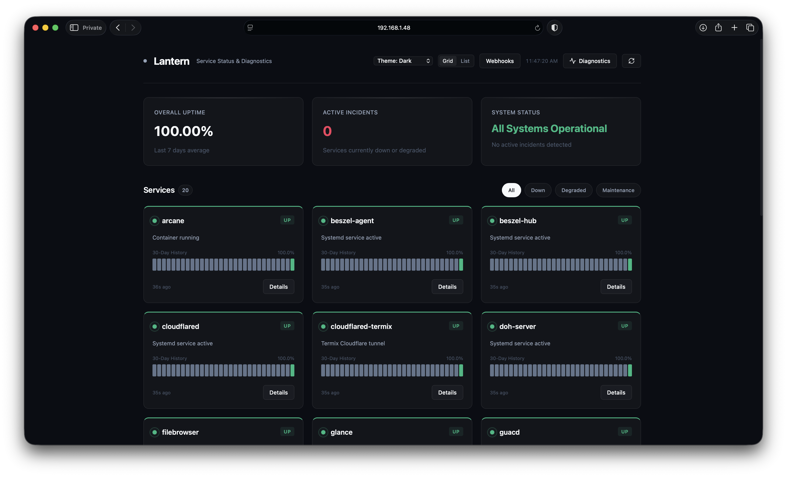
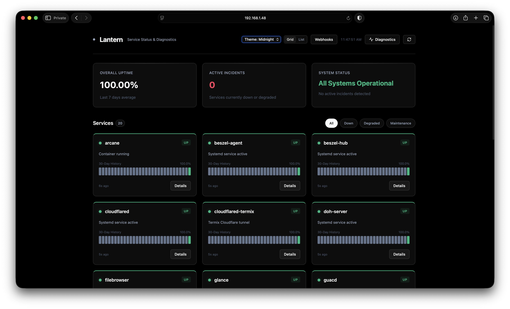
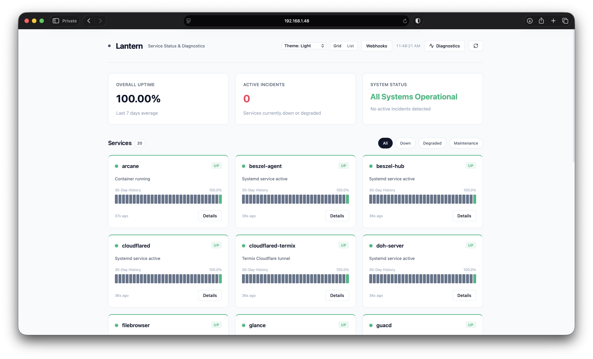
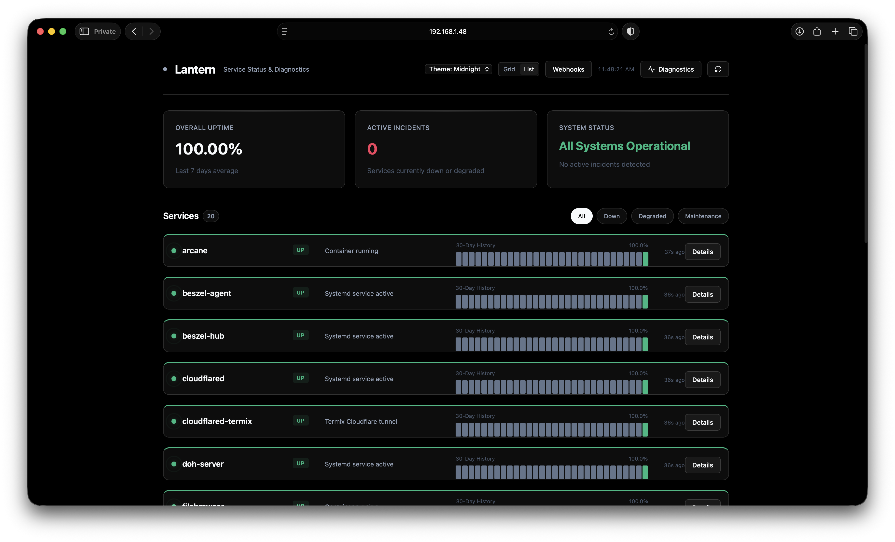

# Lantern

Lantern is a zero-dependency, ultra-lightweight status dashboard and monitoring server built in Go. It provides a sleek, single-page application (SPA) UI with dark/light themes and a completely push-based "heartbeat" API for tracking service uptimes, downtimes, and maintenance windows.

It uses a `modernc.org/sqlite` backend (no CGO required, cross-compiles easily) and compiles down to a single tiny binary or a lightweight Docker container.



## Features (v0.3.0)

- **Push-based Heartbeats**: Services report their own status. No active scraping means Lantern can run securely behind NATs or on the edge.
- **Background Stale Detection**: Automatically marks services as "Down" (Stale) if they miss their heartbeat window (configurable via `LANTERN_STALE_HOURS`).
- **Webhooks & Notifications**: Native integrations with Discord, Telegram, Gotify, and generic webhooks to alert you immediately on service degradation.
- **Maintenance Mode**: One-click UI toggles to silence alerts and ignore downtime during planned maintenance.
- **Sleek UI Dashboard**: A dependency-free HTML/JS frontend featuring Grid and List views, historical 30-day sparklines, diagnostic drawers, and real-time DOM diffing.
- **Scoped API Tokens**: Secure your ingest APIs using Bearer tokens while keeping your status dashboard public via unauthenticated read-only routes.

## Screenshots

<table>
  <tr>
    <td></td>
    <td></td>
  </tr>
  <tr>
    <td></td>
    <td></td>
  </tr>
</table>

## Quick Start (Docker)

The easiest way to get started is with Docker Compose.

```yaml
services:
  lantern:
    image: ghcr.io/yourusername/lantern:v0.3.0
    build: .
    container_name: lantern
    restart: unless-stopped
    ports:
      - "7654:7654"
    volumes:
      - lantern_data:/data
    environment:
      # Secure your API
      - LANTERN_AUTH_TOKEN=your_secret_token
      # Configure Notifications
      - LANTERN_WEBHOOK_DISCORD=https://discord.com/api/webhooks/...

volumes:
  lantern_data:
```

```bash
docker compose up -d
```

Access the dashboard at `http://localhost:7654/`.

## Environment Variables

| Variable | Default | Description |
|---|---|---|
| `LANTERN_PORT` | `7654` | The HTTP port the server listens on. |
| `LANTERN_DB_PATH` | `lantern.db` | Path to the SQLite database file. |
| `LANTERN_RETENTION_DAYS` | `30` | Number of days to keep historical status events. |
| `LANTERN_STALE_HOURS` | `24` | Hours to wait before marking a missing service as stale. |
| `LANTERN_AUTH_TOKEN` | `(empty)` | Bearer token to secure write actions (POST endpoints). |
| `LANTERN_WEBHOOK_DISCORD` | `(empty)` | Webhook URL for Discord notifications. |
| `LANTERN_WEBHOOK_TELEGRAM` | `(empty)` | Webhook URL for Telegram notifications. |
| `LANTERN_WEBHOOK_GOTIFY` | `(empty)` | Webhook URL for Gotify notifications. |
| `LANTERN_WEBHOOK_GENERIC` | `(empty)` | Generic JSON Webhook URL. |

## API Reference

### 1. Heartbeat / Push Status (`POST /api/status`)

Send a status update for a service. Allowed statuses: `up`, `down`, `degraded`.

```bash
curl -X POST http://localhost:7654/api/status \
  -H "Authorization: Bearer your_secret_token" \
  -H "Content-Type: application/json" \
  -d '{
    "service_name": "database",
    "status": "up",
    "message": "Latency normal"
  }'
```

### 2. Get Services (`GET /api/services`)

Returns the unified JSON payload for the dashboard, including calculated uptimes and 30-day bucket history.

```bash
curl http://localhost:7654/api/services
```

### 3. Toggle Maintenance Mode (`POST /api/status`)

Simply pass `maintenance: true` in your status payload.

```bash
curl -X POST http://localhost:7654/api/status \
  -H "Authorization: Bearer your_secret_token" \
  -H "Content-Type: application/json" \
  -d '{
    "service_name": "worker-node",
    "maintenance": true
  }'
```

### 4. Test Webhooks (`POST /api/webhooks/test`)

Dispatch a test notification to verify your integrations.

```bash
curl -X POST http://localhost:7654/api/webhooks/test \
  -H "Authorization: Bearer your_secret_token" \
  -H "Content-Type: application/json" \
  -d '{"channel": "all"}'
```

## Building from Source

Lantern can be natively compiled into a standalone binary:

```bash
go mod download
go build -ldflags="-s -w" -o lantern .
./lantern
```

## License
MIT License
