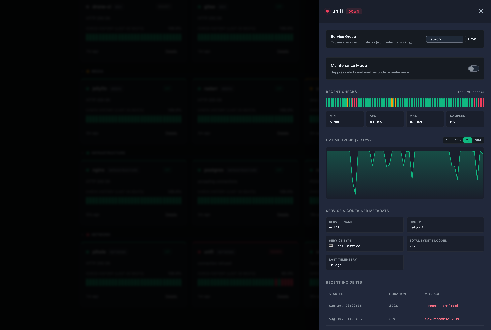
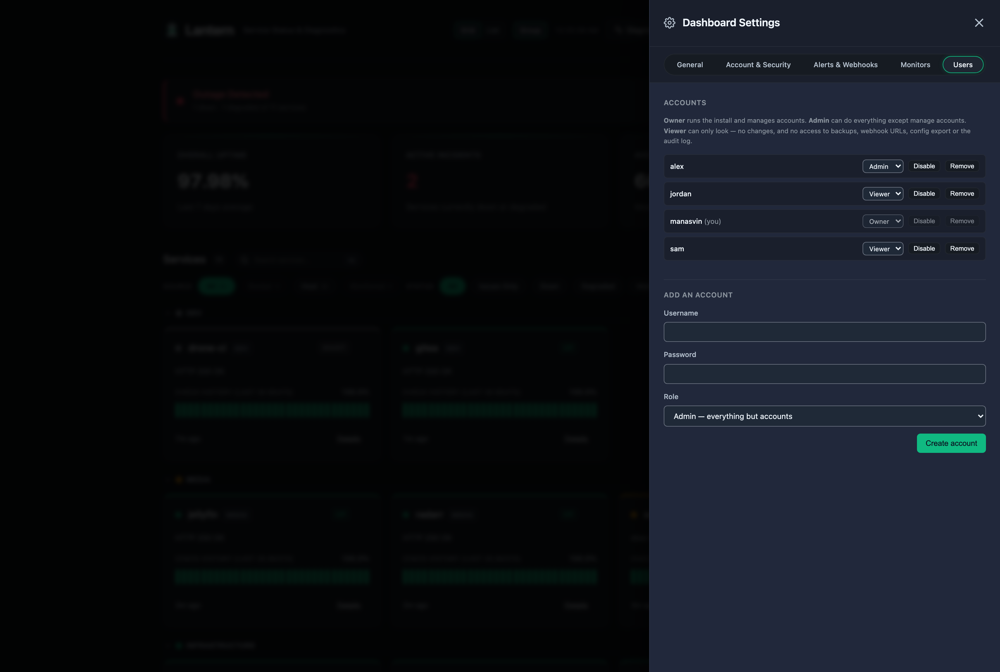
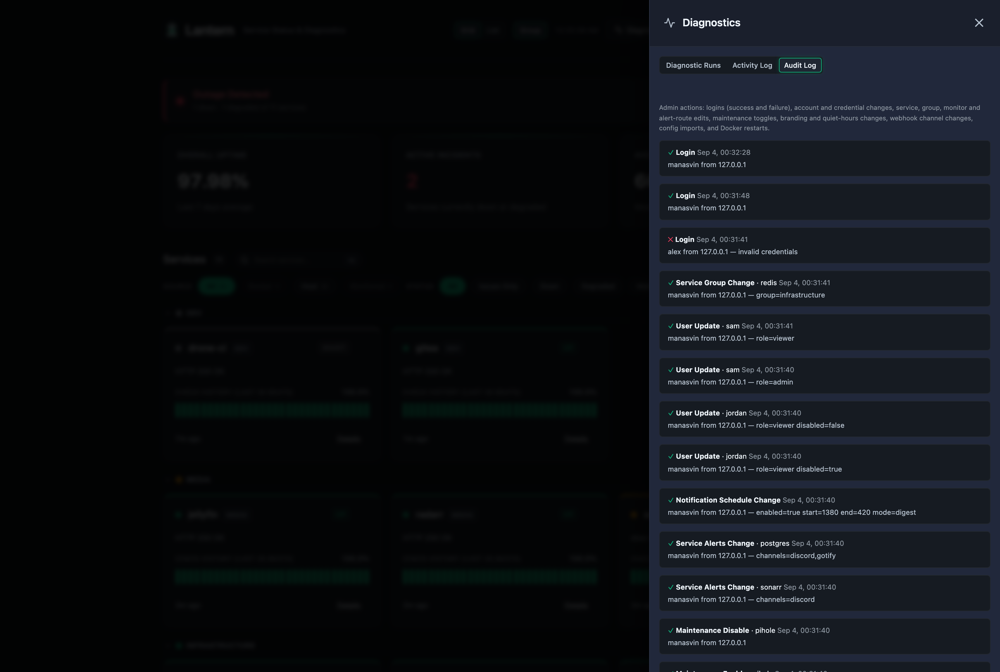

# Lantern

> ### Current release: v0.70.1 — stable since v0.60.0
>
> The REST API and database schema are considered stable. Breaking changes will come
> with a major version bump and upgrade notes. Pinning a version tag rather than
> `latest` is still the recommendation for anything you depend on, and
> [backups](docs/BACKUP.md) are still a good idea.
>
> **v0.70.0 adds multi-user accounts.** Lantern used to hold exactly one operator;
> it now has accounts with three roles — **owner** (runs the install and manages
> accounts), **admin** (everything except accounts), and **viewer** (read-only, and
> with no access to backups, webhook URLs, config export or the audit log). An
> existing single operator becomes the owner automatically on first boot; nothing
> to do on upgrade. See [Users & roles](docs/CONFIG.md#users--roles).
>
> Also since v0.62: worst-status **group rollups**, an **admin audit log**,
> **notification quiet hours** (mute or batch into a digest), and **status page
> branding** with a matching [custom-domain guide](docs/CUSTOM_DOMAIN.md).
>
> **On exposure:** Lantern is built for a home or private network. It ships with a
> sign-in gate, roles, per-request timeouts, and a deliberately small anonymous surface,
> but it is not a hardened public-internet service — there is no rate limiting beyond the
> login throttle, and no WAF. If you put it on the open internet, put a reverse proxy with
> TLS in front of it and turn sign-in on. Bug reports and issues are very welcome.

Lantern is a lightweight status dashboard and monitoring server built in Go. It provides a single-page application (SPA) UI with dark/light themes, native Docker container discovery, a push-based "heartbeat" API, and optional active checks for tracking service uptimes, downtimes, and maintenance windows in real time.

It uses a `modernc.org/sqlite` backend (no CGO required, cross-compiles easily) and compiles down to a single tiny binary or a lightweight Docker container.


## Features

### Knowing what is running

- **Native Docker discovery** — mount the Docker socket and Lantern finds and polls every container on the host by itself. No push script, no agent, no per-service config. New containers appear automatically; opt one out with the label `lantern.ignore=true`.
- **Socket-proxy support** — instead of mounting the raw socket, point Lantern at a [`docker-socket-proxy`](https://github.com/Tecnativa/docker-socket-proxy) over TCP with the standard `DOCKER_HOST` (`tcp://proxy:2375`). `https://` and `DOCKER_TLS_VERIFY` work too. Only read when set, so socket-mount deployments are unaffected.
- **Push-based heartbeats** — services report their own status to `POST /api/status`, so Lantern can track what it cannot reach: hosts behind NAT, systemd units, anything with a shell and `curl`.
- **Active monitoring** — or have Lantern check a service itself: HTTP(S), TCP port, or real ICMP ping, on a configurable interval through a bounded worker pool. Results feed the same history, uptime and incident pipeline.
- **Response body validation** — an HTTP monitor can require a regex match or a JSON-path value in the response body, not just a 2xx.
- **Stale detection** — a service that misses its heartbeat window is marked down automatically (`LANTERN_STALE_HOURS`).
- **Source filters** — every service reports whether its status came from active monitoring, Docker discovery, or a pushed heartbeat, with one-click filtering by source.

### Seeing it

- **Real-time dashboard** — a WebSocket pushes status changes to every open dashboard within about a second, with automatic reconnection and a polling fallback. Cards glow briefly in their status colour when a live update lands.
- **Live heartbeat bar** — the last 30 checks as a sliding bar per card, new beats animating in as they arrive. Hover one for how long ago it landed, its absolute time, its latency, and the reported message.
- **Per-check latency** — every status event records how long its check took, from all three sources.
- **Service groups with rollups** — organise services into groups (`media`, `networking`, …). Each group header carries the worst status underneath it, so a collapsed group still tells you something is wrong. Groups collapse and remember their state.
- **Service detail inspector** — container ports, image tags, IP addresses, network topology, health-check history, and an uptime graph, per service.
- **Command palette** — `Cmd`/`Ctrl`+`K` (or `/`) fuzzy-searches every service.
- **Instant search & filters** — substring search across names, groups and messages, with proper empty states.
- **Public status page** — `/status` is anonymous by construction, and can be [branded](docs/API.md) with your own name, logo and accent, or served on [your own domain](docs/CUSTOM_DOMAIN.md).
- **Status badges** — `GET /api/badge/{service}.svg` renders an embeddable shields-style badge, served anonymously so it works in a README.
- **Announcement banner** — pin a maintenance or incident notice to the dashboard and the public status page in three severities. Reading it is always anonymous; publishing needs admin.
- **Themes & accent picker** — Dark, Midnight and Light, with a customisable accent that repaints the chrome and nothing semantic. Status colours are fixed on purpose: a user-chosen amber must never make `up` look like `degraded`.
- **Responsive** — usable down to mobile widths, not merely non-overflowing.
- **Installable (PWA)** — a web app manifest and an SVG icon, so Lantern installs to a phone home screen or a desktop dock and opens standalone.

### Being told about it

- **Discord, Telegram, Gotify and generic webhooks** — configured and tested from Settings, dispatched through a bounded worker pool with per-request timeouts, so a slow endpoint never delays status ingestion. Every attempt is logged.
- **Flap dampening** — an outage must be confirmed by two consecutive `down` checks before it notifies, and notifies once per episode rather than once per check. A single bad check produces no traffic at all.
- **Per-service alert routing** — send one service's alerts to Discord and another's to Telegram. A service with no route alerts everywhere, so existing installs are unchanged.
- **Quiet hours** — a daily window (wrapping past midnight is fine) that either **mutes** notifications or **batches** them into one digest per channel, sent when the window closes.
- **Maintenance mode** — silence alerts and ignore downtime for planned work, per service, on a one-click toggle or a schedule.
- **TLS expiry tracking** — HTTPS monitors read the live certificate and classify it `ok`/`warning`/`critical`/`expired` against `LANTERN_CERT_WARN_DAYS` and `LANTERN_CERT_CRITICAL_DAYS`. Days from expiry degrades the service; expired marks it down.

### Access & security

- **Accounts with roles** — **owner** manages accounts and everything else, **admin** does everything except accounts, **viewer** is read-only and cannot reach backups, webhook URLs, config export or the audit log. Passwords are bcrypt-hashed into SQLite. Demoting or disabling an account binds on that account's very next request, not at next sign-in.
- **Cookie sessions** — `HttpOnly`, `SameSite=Strict`, which is also what authenticates the live WebSocket feed, since a browser's `WebSocket` constructor cannot send an `Authorization` header. Failed logins are throttled per client address.
- **Admin & scoped API tokens** — an installation-wide `LANTERN_AUTH_TOKEN` for automation, plus per-service scoped tokens that can only speak for the one service they were issued for and are refused outright on any route reaching further.
- **Audit log** — a persisted record of who did what: logins (success and failure, with source IP), account and credential changes, service deletion, monitor and alert edits, maintenance toggles, webhook changes (channel names only, never URLs), config imports, and Docker restarts.

### Running it

- **Database backup** — a consistent point-in-time snapshot of the whole database via `VACUUM INTO`, safe under concurrent writes, downloadable from Settings. See [Backup & Restore](docs/BACKUP.md).
- **Config export & import** — `GET /api/config/export` serialises every service, probe, group, alert route and webhook to portable JSON; `POST /api/config/import` restores it. Secrets redacted by default.
- **Data export** — any service's full status history as CSV or JSON from its detail drawer.
- **Docker controls** — container restart and live log tails from the service drawer, behind admin auth.
- **Prometheus metrics** — a `/metrics` endpoint for service status, uptime ratios and incident counts.
- **Cross-service activity log** — a chronological feed of every status change and webhook attempt across all services, in the Diagnostics drawer.
- **Service lifecycle** — delete a service and everything recorded about it in a single transaction, or trigger a check on demand instead of waiting for the next tick.

## Screenshots

<table>
  <tr>
    <td></td>
    <td></td>
  </tr>
  <tr>
    <td></td>
    <td></td>
  </tr>
  <tr>
    <td></td>
    <td></td>
  </tr>
</table>

## Quick Start (Docker)

The easiest way to get started is with Docker Compose.

```yaml
services:
  lantern:
    image: ghcr.io/manasvinyadav/lantern:v0.70.1
    container_name: lantern
    restart: unless-stopped
    ports:
      - "7654:7654"
    volumes:
      - lantern_data:/data
      # Mount the Docker socket to enable native container discovery.
      # Note: :ro applies to the mount point, not to the Docker API — the
      # daemon still accepts writes over this socket, so treat access to it
      # as equivalent to root on the host.
      - /var/run/docker.sock:/var/run/docker.sock:ro
    environment:
      # Secure your API
      - LANTERN_AUTH_TOKEN=your_secret_token
      # Configure Notifications
      - LANTERN_WEBHOOK_DISCORD=https://discord.com/api/webhooks/...

volumes:
  lantern_data:
```

```bash
docker compose up -d
```

Access the dashboard at `http://localhost:7654/`. Every container on the host appears
on its own, with no further configuration.

**Then turn sign-in on.** A fresh install is deliberately wide open — that is what lets
you enable auth from a dashboard you can already reach. Go to **Settings → Account &
Security**, set a username and password, and you become the **owner**. Add further
accounts, with roles, at **Settings → Users**. You can also seed the first account from
the environment with `LANTERN_AUTH_USER` and `LANTERN_AUTH_PASS`; those are read on first
boot only, so a password you later change in the dashboard is not reverted by a stale
variable on the next restart.

### Using a Socket Proxy (Recommended for Security)

Mounting the raw Docker socket gives Lantern (and anything else that can reach
it) unrestricted daemon access — effectively root on the host. A socket proxy
such as [`docker-socket-proxy`](https://github.com/Tecnativa/docker-socket-proxy)
exposes only the read-only Docker API endpoints Lantern actually needs, and
Lantern can connect to it over TCP using the standard `DOCKER_HOST` variable:

```yaml
services:
  socket-proxy:
    image: tecnativa/docker-socket-proxy
    container_name: socket-proxy
    restart: unless-stopped
    volumes:
      - /var/run/docker.sock:/var/run/docker.sock:ro
    environment:
      # Grant only what Lantern needs:
      CONTAINERS: 1   # container list + inspect (discovery, metadata, logs)
      INFO: 1         # GET /info — TCP availability probe
      POST: 1         # POST /containers/{id}/restart — container restart
    networks:
      - socket-proxy

  lantern:
    image: ghcr.io/manasvinyadav/lantern:v0.70.1
    container_name: lantern
    restart: unless-stopped
    ports:
      - "7654:7654"
    volumes:
      - lantern_data:/data
      # No socket mount needed — Lantern connects via DOCKER_HOST instead.
    environment:
      - DOCKER_HOST=tcp://socket-proxy:2375
      - LANTERN_AUTH_TOKEN=your_secret_token
    networks:
      - socket-proxy
    depends_on:
      - socket-proxy

volumes:
  lantern_data:

networks:
  socket-proxy:
```

`DOCKER_HOST` supports the same schemes the Docker CLI does:

| Value | Transport |
|---|---|
| *(unset)* | Default Unix socket `/var/run/docker.sock` |
| `unix:///path/to/docker.sock` | Explicit Unix socket |
| `tcp://host:port` or `http://host:port` | Plain TCP (e.g. socket proxy) |
| `https://host:port` | TLS — also triggered by `DOCKER_TLS_VERIFY=1` |

See the [Configuration Guide](docs/CONFIG.md#native-docker-discovery) for the
full variable reference including `DOCKER_TLS_VERIFY` and `DOCKER_CERT_PATH`.

### Not using Docker?

Discovery simply stays inactive if the socket is not mounted, and Lantern works exactly
as before via `POST /api/status` and active monitors. To monitor things Docker cannot
see — systemd units, remote hosts, cron jobs — push a heartbeat:

```bash
curl -sf -X POST http://localhost:7654/api/status \
  -H "Content-Type: application/json" \
  -d '{"service_name":"nightly-backup","status":"up","message":"Completed","latency_ms":812}'
```

## Status Badges

Embed a live badge for any service:

```markdown

```

Colors follow the service's current status: green for up, red for down, amber for
degraded, grey for maintenance or unknown.

## Security

Lantern has three authentication modes, and picks based on what you configure:

| Configured | Behaviour |
|---|---|
| Nothing | Fully open. The out-of-the-box default, kept deliberately so that adding auth can never lock an existing deployment out of itself. Account management is the one thing still refused in this mode — otherwise anyone reaching the port could mint themselves an owner. |
| `LANTERN_AUTH_TOKEN` | Writes, Docker controls, `GET /api/backup` and `GET /api/webhooks` require the bearer token. Dashboard reads stay open and no login wall appears. The token authenticates as **admin**, never owner: a static string in an env var should be able to run the installation, not mint accounts on it. |
| Username + password | A login gate in front of everything except the public status surface, with per-account roles. |

### Roles

| | viewer | admin | owner |
|---|---|---|---|
| Read the dashboard, history, incidents | ✅ | ✅ | ✅ |
| Push status, trigger checks, maintenance mode | | ✅ | ✅ |
| Services, monitors, groups, alert routes, branding, quiet hours | | ✅ | ✅ |
| Backup, webhook URLs, config export/import, audit log | | ✅ | ✅ |
| Create, disable, re-role and remove accounts | | | ✅ |

The gate is enforced server-side in the auth middleware, before any handler runs — the
dashboard hides controls a role cannot use, but that is a courtesy, not the boundary.
Roles are read live from the database on every request, so demoting or disabling someone
takes effect on their very next request rather than at their next sign-in. The last
enabled owner cannot be deleted, disabled or demoted, and you cannot delete the account
you are signed in as.

Per-service **scoped API tokens** are a separate axis, for machines rather than people.
A scoped token speaks for exactly one service and is refused on any route that reaches
further — the backup, webhook URLs, config export/import, the audit log, account
management, and the global branding and quiet-hours settings.

### Always anonymous

These stay open whatever you configure, because they have to:
`/status` and the static shell, `GET /api/public/services`, `/api/public/groups`,
`/api/public/services/{name}/uptime`, `/api/public/ws`, `/api/public/banner`,
`/api/public/branding`, `/api/badge/*`, `/metrics`, `/api/health`, `/api/docs`, and the
two endpoints needed to sign in. The exact list is in the
[Configuration Guide](docs/CONFIG.md#always-open).

**v0.60.0 fixes several authentication flaws** found in a pre-release audit, including an
unauthenticated admin takeover reachable when only `LANTERN_AUTH_TOKEN` was set, and a
stored cross-site scripting flaw reachable by anyone able to push a status event.
**v0.63.1 fixes a privilege escalation** where a per-service scoped API token could
authenticate against installation-wide routes and download a full database snapshot —
credential hash, session hashes, and every other service's token. If you run any earlier
version, upgrading is worth doing promptly; see the [changelog](CHANGELOG.md) for the
full list and for what to rotate afterwards.

Found something? Open an issue, or contact the maintainer privately for anything
exploitable.

## Documentation Suite

Lantern is highly configurable. Dive into the detailed guides below:

- 📖 **[API Reference](docs/API.md)**: Full list of endpoints, payloads, and examples.
- ⚙️ **[Configuration Guide](docs/CONFIG.md)**: Detailed breakdown of all environment variables, auth, and database settings.
- 🐳 **[Docker Discovery](docs/CONFIG.md#native-docker-discovery)**: How native container discovery works, its status mapping, and how to opt containers out.
- 🔌 **[Socket Proxy Setup](docs/CONFIG.md#socket-proxy)**: How to use `DOCKER_HOST` with `docker-socket-proxy` instead of mounting the raw socket.
- 🔔 **[Webhooks & Notifications](docs/WEBHOOKS.md)**: Setup guides for Discord, Telegram, Gotify, and generic integrations.
- 💾 **[Backup & Restore](docs/BACKUP.md)**: How to download a consistent database snapshot and restore it.
- 🌐 **[Custom Domains](docs/CUSTOM_DOMAIN.md)**: Serving the status page on your own hostname, and what changes behind a reverse proxy.
- 📝 **[Changelog](CHANGELOG.md)**: Release history and patch notes.

## Quick API Example

Pushing a heartbeat is as simple as a single POST request:

```bash
curl -X POST http://localhost:7654/api/status \
  -H "Authorization: Bearer your_secret_token" \
  -H "Content-Type: application/json" \
  -d '{
    "service_name": "database",
    "status": "up",
    "message": "Latency normal",
    "latency_ms": 42
  }'
```

## Building from Source

Lantern can be natively compiled into a standalone binary:

```bash
go mod download
go build -ldflags="-s -w" -o lantern .
./lantern
```

Run the test suite with:

```bash
go vet ./... && go test -race ./...
```

CI runs `gofmt`, `go vet` and `go test -race` on every push, and the container image is
only built if they pass.

> On a 64-bit Raspberry Pi, `-race` aborts with `unsupported VMA range`: Raspberry Pi OS
> builds its kernel with `CONFIG_ARM64_VA_BITS=39`, and ThreadSanitizer needs a wider
> address layout. This is specific to that kernel configuration — macOS and ordinary
> x86-64 Linux are both fine. Drop the flag when testing on the Pi and let CI cover it.

## License
MIT License
